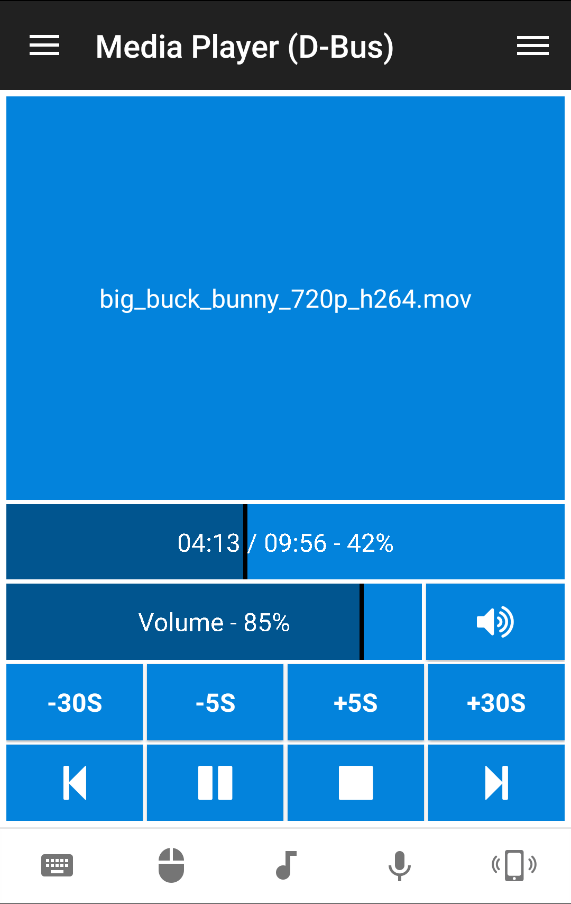

# unified-remote-dbus
Control any media players registered on the D-Bus which conform to the [Media Player Remote Interfacing Specification (MPRIS)](https://www.freedesktop.org/wiki/Specifications/mpris-spec/).

## Features
* Playback functions according to the [MediaPlayer2.Player](https://specifications.freedesktop.org/mpris-spec/latest/Player_Interface.html) Interface

## Requirements
* D-Bus
* Python 2.7 (modules: glib, gobject, dbus)

## Setup
https://www.unifiedremote.com/tutorials/how-to-install-a-custom-remote

## Download
https://github.com/miniME89/unified-remote-dbus/archive/master.zip

## Github
https://github.com/miniME89/unified-remote-dbus

## Screenshots

## License
MIT
